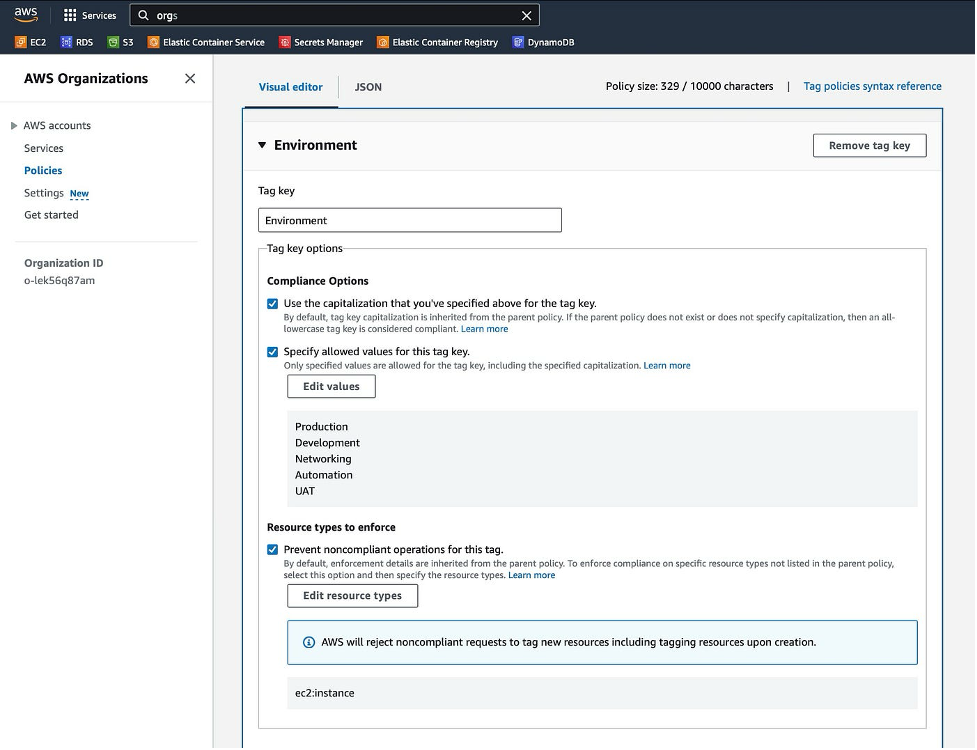

# Hands-On Workshop: Enforcing Tagging in AWS Using Tagging Policies and Service Control Policies


## Introduction

In this hands-on workshop, we will explore the implementation of AWS resource tagging strategies using Tagging Policies and Service Control Policies (SCPs). This workshop focuses on the widely used EC2 service as an illustrative example.

## AWS Resource Tagging Overview

AWS resources tagging provides a powerful means to organize, filter, and search for resources. This workshop will demonstrate how to effectively manage and govern resources using tags.

### Requirements

- An active AWS account (with necessary permissions) and access to the AWS Management Console.
- AWS Organization
- Basic familiarity with AWS services, particularly EC2 instances.

## Section 1: Building a Tagging Strategy with AWS Organizations

### 1.1 Creating Tag Policies

Discover how to utilize AWS Tag Policies to enforce a standardized tagging policy. Create policies specifying accepted tag keys and values for resources within the organization.

### 1.2 Tag Policy Enforcement Example

Follow these steps to create and associate a tag policy for EC2 instances, ensuring adherence to predefined tagging conventions.

#### Step 1: Access AWS Organizations Console

- Navigate to the AWS Management Console.
- Open the “AWS Organizations” service.
- Enable Tag policies.


#### Step 2: Create Tag Policy

- In the left navigation pane, select “Tag policies.”
- Click on “Create tag policy.”




- Define the tag policy by specifying tag keys and values. Let’s set tag policies for “Environment” and “Project” tags for EC2 Instance. Edit values and set your tag value(s).


- Save the policy.

#### Step 3: Associate Tag Policy

- Associate the created tag policy with the root or specific organizational unit (OU) or Account.


#### Step 4: Test the Tag Policy

- Create a new EC2 instance and verify that the tags specified in the tag policy are enforced during creation.

  #### **Using the Wrong Tag values**
   
   

   #### **Using the right Tag values**
   
   

   **Note** that the Tag Policy solely validates the accepted value of a tag and not its existence. Users with the necessary IAM permissions will still be able to create resources without tags. To restrict the creation of AWS resources lacking the required tags, we will employ Service Control Policies (SCPs) to establish protective boundaries for resource creation requests.

## Section 2: Enhancing Governance with Service Control Policies (SCPs)

### 2.1 Introduction to Service Control Policies (SCPs)

Understand how SCPs provide fine-grained control over AWS services within an organization, allowing administrators to define allowed or denied actions.

### 2.2 Denying Resource Creation Without Required Tags

Explore how SCPs can be used to deny the creation of resources lacking specific tags. This reinforces governance and cost tracking.

#### SCP Enforcement Example

Continue with the previous example and create an SCP that denies the creation of EC2 instances without specific tags.

#### Step 1: Access AWS Organizations Console

- Navigate to the AWS Management Console.
- Open the “AWS Organizations” service.
- Enable Service Control policies.


#### Step 2: Create SCP

- In the left navigation pane, select “Policies” -> “Service control policies.”
- Click on “Create policy.”


- Define the SCP to deny actions based on conditions, like creating EC2 instances without specific tags. You can use the tabs on the right side to define the Action, Resources, and Conditions or Choose the “JSON” tab and define the SCP to deny actions based on conditions, like creating EC2 instances without specific tags.


```json
{
  "Version": "2012-10-17",
  "Statement": [
    {
      "Sid": "DenyEC2CreationSCP1",
      "Effect": "Deny",
      "Action": [
        "ec2:RunInstances"
      ],
      "Resource": [
        "arn:aws:ec2:*:*:instance/*"
      ],
      "Condition": {
        "Null": {
          "aws:RequestTag/Environment": "true"
        }
      }
    },
    {
      "Sid": "DenyEC2CreationSCP2",
      "Effect": "Deny",
      "Action": [
        "ec2:RunInstances"
      ],
      "Resource": [
        "arn:aws:ec2:*:*:instance/*"
      ],
      "Condition": {
        "Null": {
          "aws:RequestTag/Project": "true"
        }
      }
    }
  ]
}
```
#### Step 3: Attach SCP

- Associate the created SCP with the root or specific organizational unit (OU) or Account.


#### Step 4: Test the SCP

- Attempt to create an EC2 instance without the required tags, ensuring that the SCP prevents the action.

   #### **EC2 Creation without the Required Tags**
   
   

   #### **EC2 Creation with the Required Tags**
   
   

## Section 3: Policies Enforcement Validation Test

| Tag enforcement test                                  | Result | Expected Result |
|--------------------------------------------------------|--------|-----------------|
| Without tags                                           | Failed | Yes             |
| With random tag key and value                           | Failed | Yes             |
| With tag key Environment and wrong tag value            | Failed | Yes             |
| With tag key Project only and correct tag value         | Failed | Yes             |
| With tag key Environment only and correct tag value     | Failed | Yes             |
| With both tag keys (Environment and Project) and correct tag value | Success | Yes             |

## Conclusion

By leveraging AWS Tag Policies and Service Control Policies, organizations can standardize tagging practices, enforce policy compliance, and enhance visibility into their AWS resources. This workshop has demonstrated how to apply and enforce standardized tagging during resource creation, as well as how to use SCPs to control resource creation.
